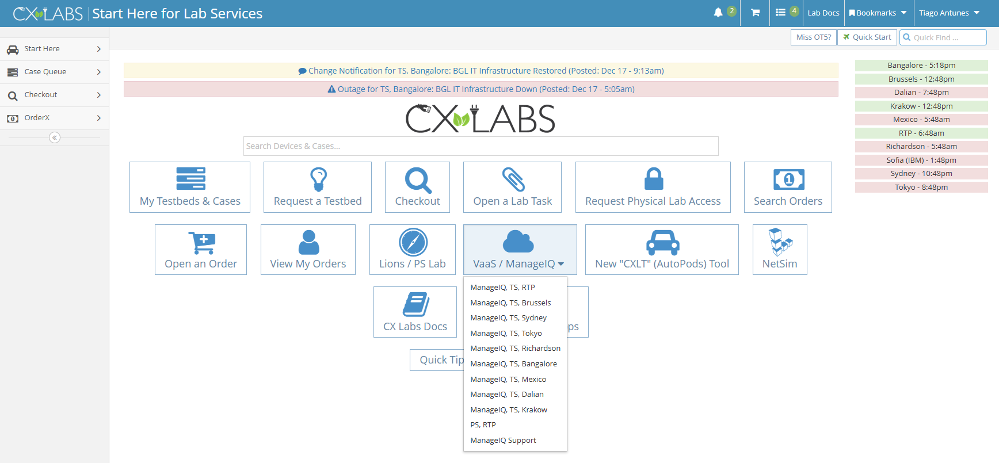

# Lab Requirements

There are few requirements for this lab: 

## A - Acccess to CFME

You must have acccess to Cisco CloudForms Management Engine (CFME).  
To verify if you have access to CFME, go to: [CXLABS]{:target="_blank"} and select your location.

 [CXLABS]: https://calo-new.cisco.com/#/tools/start_here 

For example, for EMEA choose "ManageIQ, TS, Brussels":

<figure markdown>
  
</figure>

Alternatively, you can visit the [CXLabs Wiki]{:target="_blank"} to find the direct link to each site.

 [CXLabs Wiki]: https://calo-docs.cisco.com/doku.php?id=external:cloudforms:start&s%5B%5D=calo&s%5B%5D=mxc&s%5B%5D=cfme&s%5B%5D=cisco

## B - Virtual Machine Console viewer installed. 

Download and install the Virtual Machine Console viewer:

* For Windows: [VMware Remote Console]{:target="_blank"}
 
 [VMware Remote Console]: https://docs.vmware.com/en/VMware-Remote-Console/11.0/com.vmware.vmrc.vsphere.doc/GUID-6A6E913F-47C7-4F10-B546-A0C807623DDF.html
 
* For Mac: [VMware Remote Console]{:target="_blank"}
 
 [VMware Remote Console]: https://docs.vmware.com/en/VMware-Remote-Console/11.0/com.vmware.vmrc.vsphere.doc/GUID-FAB039B7-0740-441F-B036-A9EC0D1B126B.html
 
* For Mac with M1: Download VMWare Remote Console from the App Store

## C - Knowledge of CX Labs rules and VLANs 

Depending on each CXLabs location, there are different ways to access lab devices, different VLANs and IP subnets.
Verify with your lab proctor/trainer what are the CXLabs rules you should be aware of and the VLANs and subnets on your location for wireless recreates.
For example, in EMEA BRU this is the Engineer Information: [BRU Wireless Recreates]{:target="_blank"} 

  [BRU Wireless Recreates]: https://calo-docs.cisco.com/external:sites:bru:labservices:wirelesslab

 
:memo: This lab guide is based on the TZ article [Deploy a 9800-CL WLC in CFME]{:target="_blank"}.

  [Deploy a 9800-CL WLC in CFME]: https://techzone.cisco.com/t5/Catalyst-9800-Wireless-LAN/Deploy-a-9800-CL-WLC-in-CFME/ta-p/8024004 