# Task 1: Provision a Virtual Machine (VM) with 9800-CL in CFME

## Getting started

In this task, you will order a new VM and then provision from ISO. The ISO needs to be stored on CXLabs ISO directory. 
Once the ISO is uploaded, Cloudforms will routinely scan the Datastore and discover your ISO file.  
The ISO files can be downloaded from [Cisco Software Download](https://software.cisco.com/download/home/286322605/type).  
In this lab we will use 17.15.2 that can be found here: [Release IOSXE-17.15.2](https://software.cisco.com/download/home/286322605/type/282046477/release/IOSXE-17.15.2)
 
For detailed information on how to upload your ISO, see the documentation here: [Upload ISO](https://calo-docs.cisco.com/doku.php?id=external:cloudforms:upload_iso) 
If you are not able to access the above link, follow these instructions:

 1 - Connect to your local Vaas File Server:

Site	|Protocol			|Hostname
----	|--------			|--------
BGL		|SFTP, FTP and TFTP	|calo-bgl-fs.cisco.com
BRU		|SFTP, FTP and TFTP	|calo-bru-fs.cisco.com
BRU-GDP	|SFTP, FTP and TFTP	|calo-bru-gdp-fs.cisco.com
DLC	|SFTP, FTP and TFTP	|calo-dlc-fs.cisco.com
GPK	|SFTP, FTP and TFTP	|calo-gpk-fs.cisco.com
KRK	|SFTP, FTP and TFTP	|calo-krk-fs.cisco.com
MXC	|SFTP, FTP and TFTP	|calo-mxc-fs.cisco.com
RCDN	|SFTP, FTP and TFTP	|calo-rcdn-fs.cisco.com
RTP	|SFTP, FTP and TFTP	|calo-rtp-fs.cisco.com
RTP-GDP	|SFTP, FTP and TFTP	|calo-rtp-gdp-fs.cisco.com
RTP10	|SFTP, FTP and TFTP	|calo-rtp10-fs.cisco.com
SYD	|SFTP, FTP and TFTP	|calo-syd-fs.cisco.com
TKY	|SFTP, FTP and TFTP	|calo-tky-fs.cisco.com

 2 - Login with your CEC (Cisco credentials) using the SFTP protocol (Recommended).
 
 3 - Next "cd" into the "iso" directory and place your file there:
 
<figure markdown>  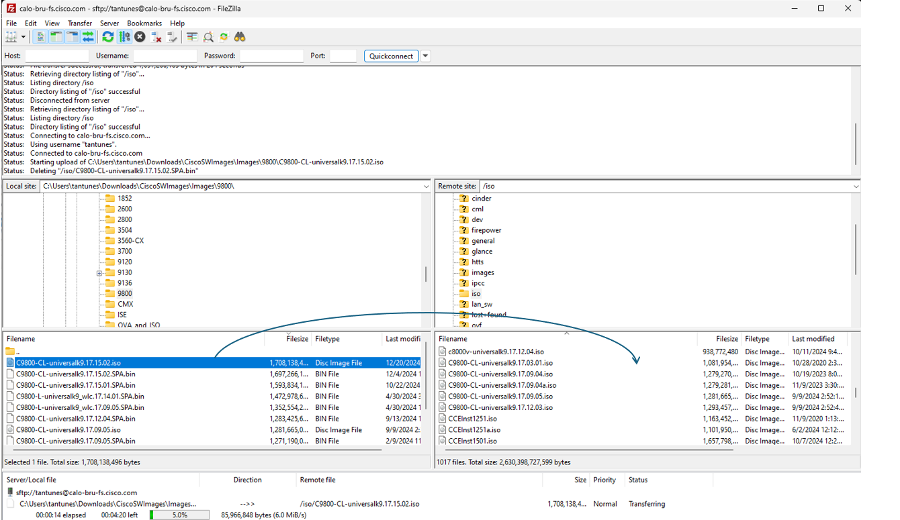
</figure>
 
 4 - Once your upload is complete, your ISO should show up in the ISO dropdown in the CloudForms UI that you will choose on Step 2.

## Configure the VM settings

### Step 1: Order a new Virtual Machine in CFME

 a - On the dashboard, click on Provision a VM:

<figure markdown>  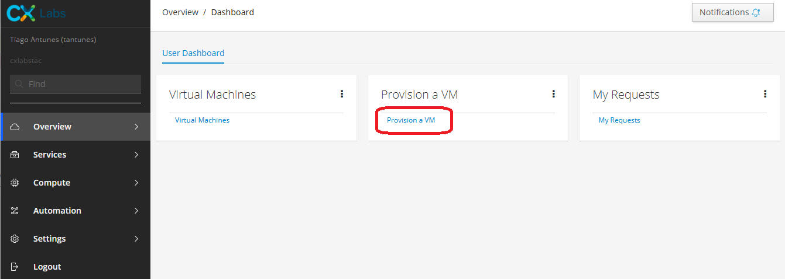
</figure>

 b - On the following page, click on VMware Provision from ISO:

<figure markdown>  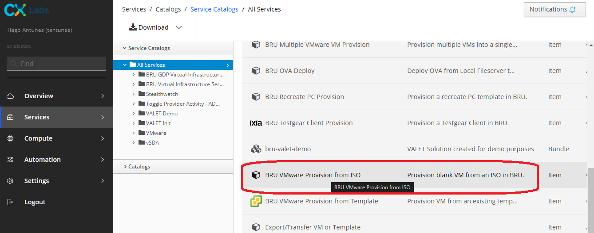
</figure>

 c - On the next page click on Order:

<figure markdown>  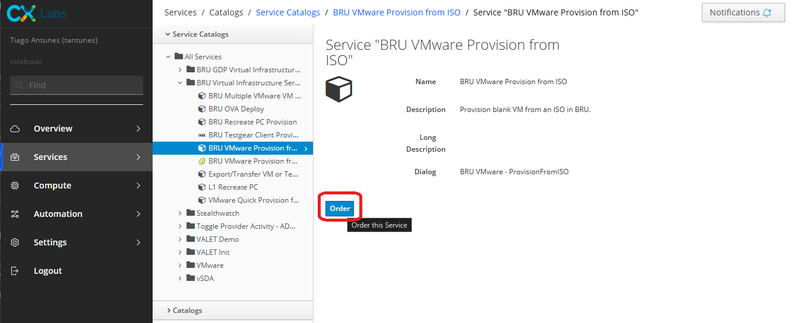
</figure>

 d - Wait a couple of seconds and the next page look like the following:

<figure markdown> 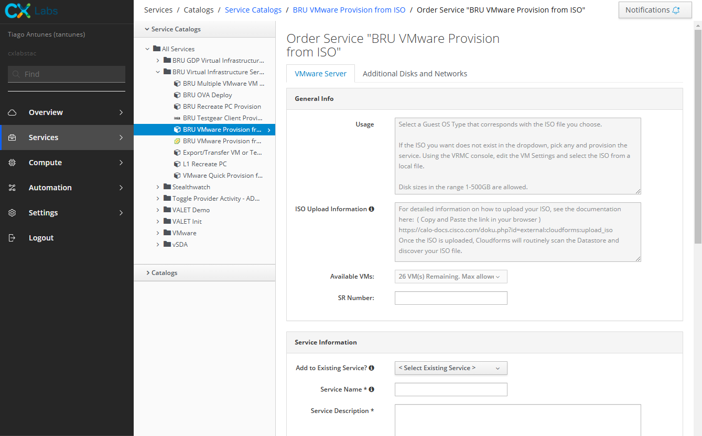
</figure>

 e - Scroll down to Service Information and enter the values:  

- Service Name: 9800-cl_nh_training
- Service Description: Basic deployment of a WLC 9800-CL
- Environment: Training (3 Months)

 f - In the VM Information section enter these values:

Field	|Value	|Notes
--------|-------|-----
VM Name	|your-CEC-9800	|Wait for the name to be validated
Guest OS Type	|Other Linux 3.x (64-bit)	|	 
Select ISO Datastore	|ISO	|	 
Select ISO File	|C9800-CL-universalk9.17.15.02.iso	|Newer ISO files should also work
Disk Size	|16	|	 
Network	|WLAAAN-BB/39	|- This may vary between sites. This example is for BRU (EMEA).   - VLANID must have already been assigned to you. This is the management VLAN of your WLC.   Please contact your lab advocate/proctor for any questions.
NIC Driver Type	|VMXNET3	|	 
Number of CPUs	|8	 |
Memory	|16 GB	 |

Should look like this:

<figure markdown> 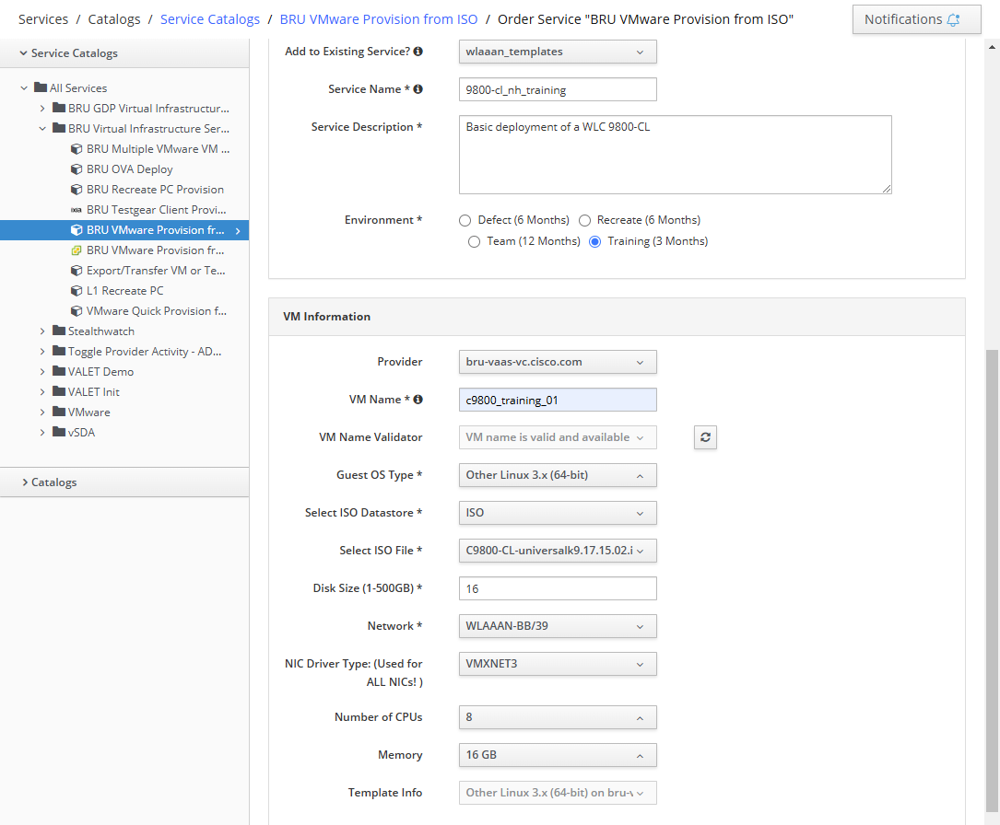
</figure>

 g - Click on the Submit button on the bottom right corner and wait for the following screen to load.

<figure markdown> 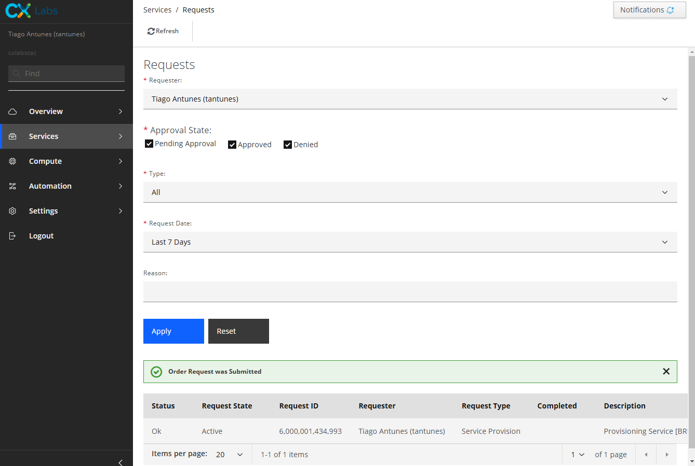
</figure>

### Step 2: Configure VM interfaces

 a - Go back to the dashboard and click on Virtual Machines. This is where all provisioned and active VMs must appear. 

<figure markdown> 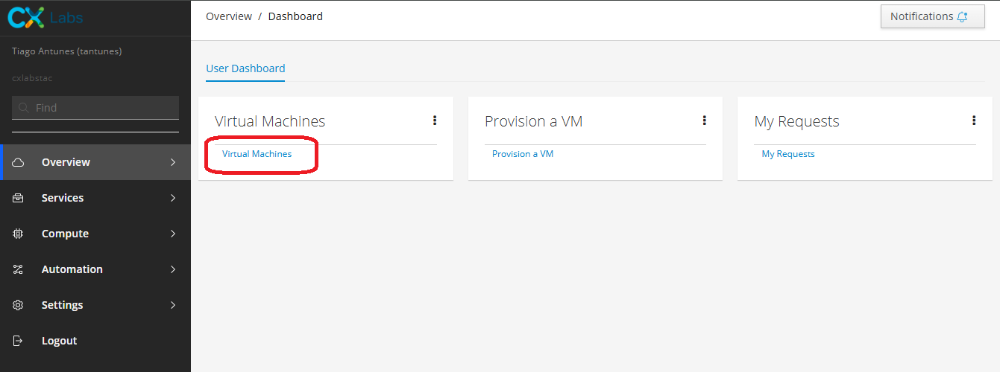
</figure>

!!!note
	Do not worry if the VM you just created does not appear on the page. It may take a couple of minutes for the VM to be fully provisioned.  

You will get an e-mail with a notification that the VM has been created.

<figure markdown> 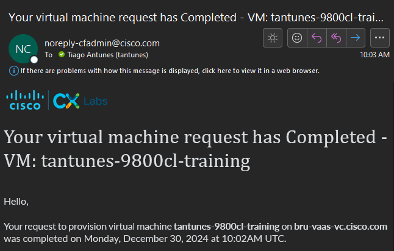
</figure>

 b - On the left side of the screen, click on "VMs I Own" to view only all of the VMs you have previously created.   
 You may need to refresh the page a couple of times until the VM shows up on the list: 

<figure markdown> 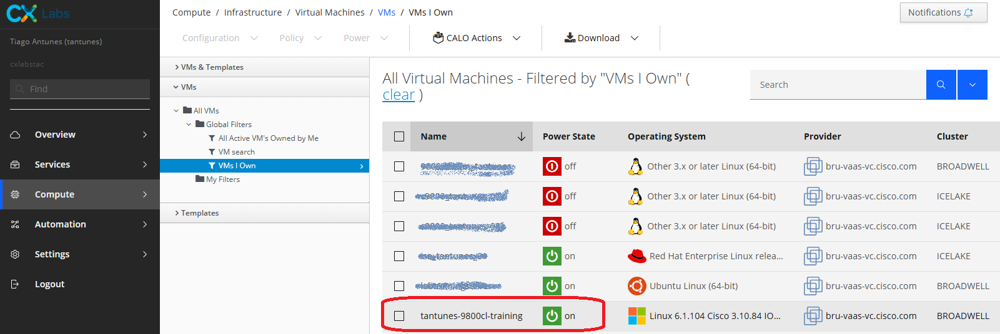
</figure>

 c - Once the VM appears on the list, wait until its Power State is on. at this point you will need to power it off to add more interfaces.  
 Select the VM recently created > Power > Power Off. Confirm the action on the small message bar shown at the top and refresh the page until the VM appears turned off.

<figure markdown> 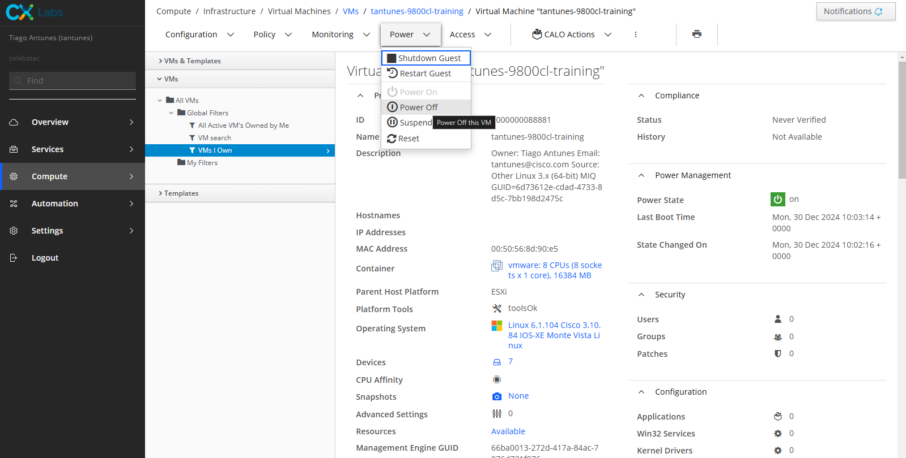
</figure>

 d - So far, the WLC created only has one network interface (GigabitEthernet1). The Catalyst 9800-CL maps the GigabitEthernet network interfaces to the logical vNIC name assigned by the VM.
 The VM in turn maps the logical vNIC name to a physical MAC address.
 
 When the Catalyst 9800-CL is booted for the first time, the interfaces are mapped to the logical vNIC interfaces that were added when the VM was created. 
 The figure below shows the relationship between the vNICs and the Catalyst 9800-CL interfaces.
 
<figure markdown> 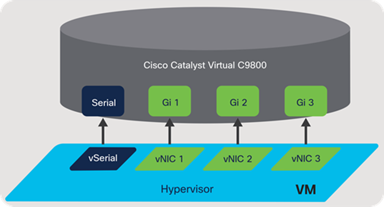
</figure>

By default, the 9800-CL comes with three network interfaces. Below is an example of interface mapping:

 - GigabitEthernet1 > Device management interface: Map it to the out-of-band management network. This is the equivalent of the service port on the physical appliance.
 - GigabitEthernet2 > Wireless management interface: Map it to the network to reach APs and services. Usually, this interface is a trunk to carry multiple VLANs.
 - GigabitEthernet3 > High Availability interface: Map it to a separate network for peer-to-peer communication for HA SSO. This is the equivalent of the RP port. This port is not needed if HA SSO is not going to be configured.

!!! note 
	In customer/production deployments we should not connect two interfaces to a single network, as that may cause network loops. When a trunk port is used, you must either prune VLANs from vCenter or have the GigabitEthernet interfaces in a different vSwitch.   In this lab we will add the 3 interfaces so that we have the WLC ready for HA configuration. Please check with your lab proctor/trainer which VLANs to use. 

 e - Click on the three button menu on the upper bar > Modify VM > Add Additional Network.
 
<figure markdown> 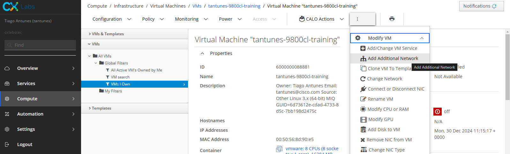
</figure>
 
Enter these values for vNIC2 (Gi2):

 - Choose Network: Please check with your lab proctor/trainer which VLANs to use. 
	- For EMEA BRU, type in the same VLANID that was entered on step 1f (WLAAAN-BB/39). 
	- For Mex-Wireless, you can use the Network NESTED-ESXI-VM-NETWORK-4095 which acts as a trunk for all VLANS in Mexico CloudForms.
 - NIC Type: VirtualVmxnet3

Click on Submit and wait for a success message to appear on the screen that says the Order Request was Submitted.

<figure markdown> 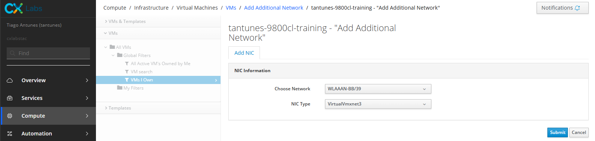
</figure>

Enter these values for vNIC3 (Gi3):

- Choose Network: Please check with your lab proctor/trainer which VLANs to use. ***If not used, ensure to keep it admin disabled.***
	- For EMEA BRU, type in the Personal VLANID that was assigned to you by CXLabs (WIRELESS/14xx).
	- For Mex-Wireless, use VLAN 2699 as the reserved RP VLAN. 
- NIC Type: VirtualVmxnet3
 
Click on Submit and wait for a success message to appear on the screen that says the Order Request was Submitted. 

 f - When you are done, the WLC must have three network interfaces. To verify, scroll down to the VM custom attributes:
 
<figure markdown> 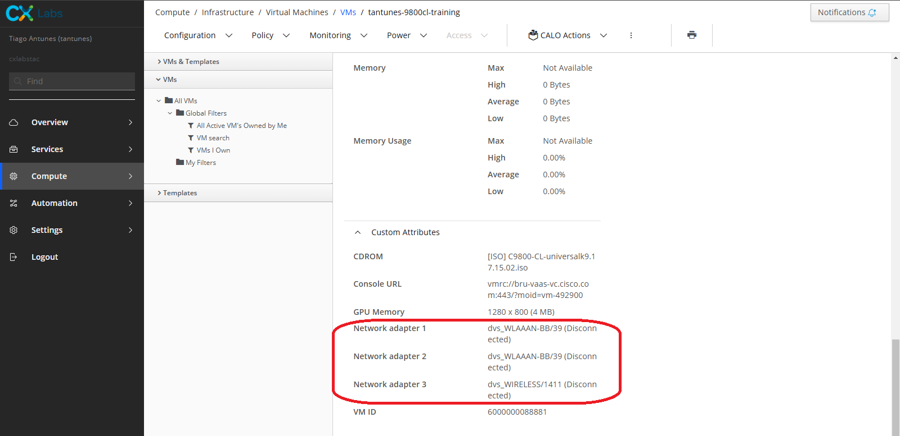
</figure> 
 
 In case you need to change the VLANs to which interface belongs, click on three-button menu at the top > Modify VM > Change Network.

<figure markdown> 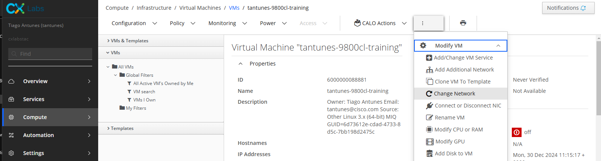
</figure>

Click on the dropdown menu at NIC To Change, you must see all three network adapters listed. If not, click on the refresh button beside the dropdown menu until they all appear listed. Change to the desired network and click on Submit.

<figure markdown> 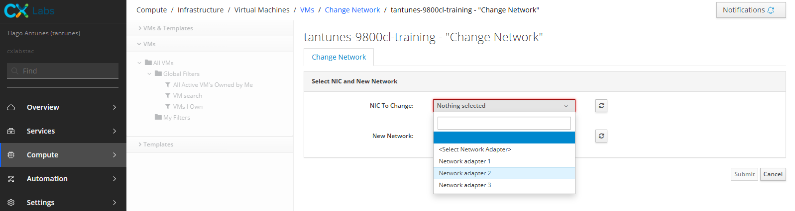
</figure>

### Step 3: Inital Boot of the new Virtual Machine (VM)
 a - Turn on the VM. Click on Power > Power On. Confirm the pop-up message that appears. Refresh the page until the Power State is set to on.
 
<figure markdown> 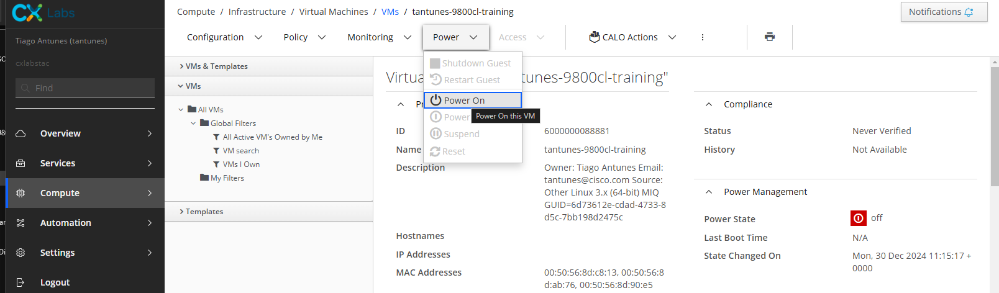
</figure>
  
 b - Open the VRMC Console. 
 
<figure markdown> 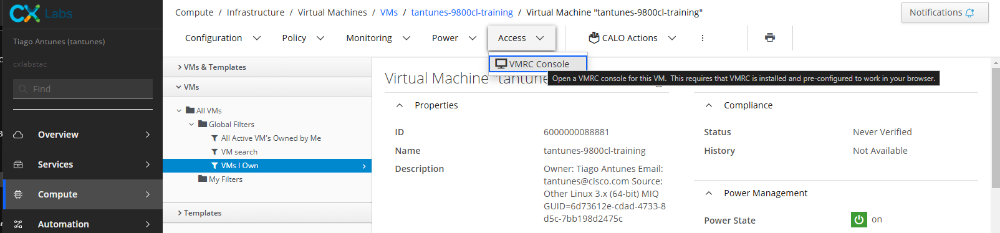
</figure>
 
!!!warning
	A console viewer must be installed in order to proceed. This is indicated in the [requirements](lab.md#b-virtual-machine-console-viewer-installed) section at the beginning of the document. 
	  Accept the first pop-up that appears on the screen and ensure there are no pop-up blockers and accept the second one.
 
Wait for the console of the WLC to finish booting. A VM window must open that shows the console of the WLC booting. Example:

<figure markdown> 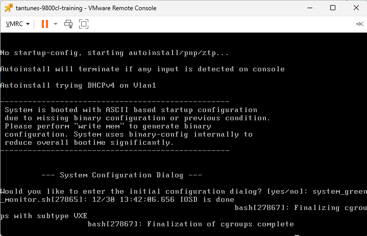
</figure>

Click on the window and wait until the Day 0 config is prompted and enter "no". Then, type in "yes" to terminate auto-install. 

At this point you will be asked to create a shared secret. You have to comply with password policy.  
Suggested password: Wireless123#. After confirming the enable secret you will be asked an option. 
Enter 2 and press Enter:

<figure markdown> 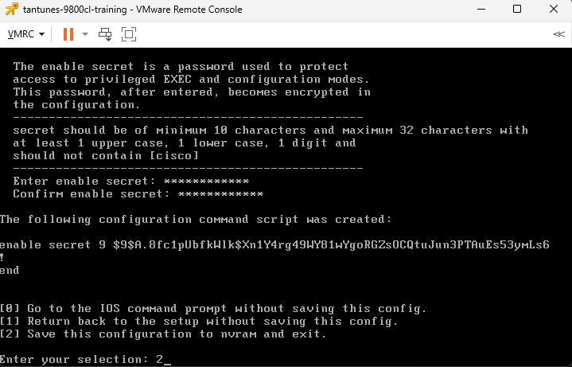
</figure>

Press Enter a couple of times and the console must be up and ready.

<figure markdown> 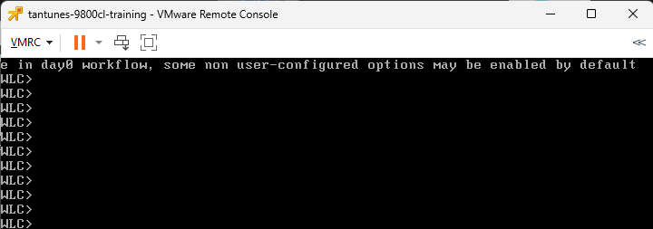
</figure>

!!!tip
	In order to exit the console, press **Ctrl + Alt** at the same time.

The 9800-CL is now successfully created. As of right now, there is no configuration on it, as the Day 0 Wizard was cancelled.  
The next task shows the basic configuration needed for the 9800.